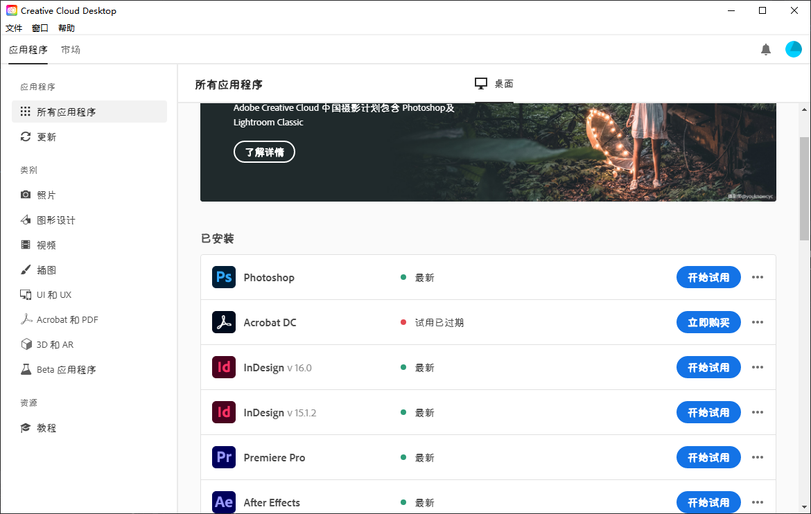
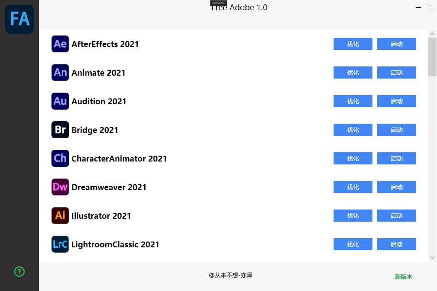
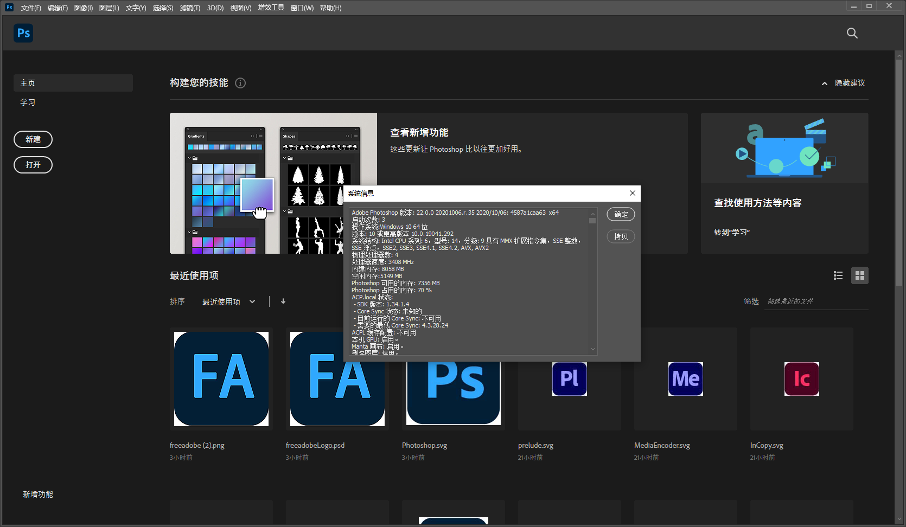

# Free Adobe 1.0

@亦泽同学

---

## 简介

FreeAdobe是一款Adobe优化软件，可以优化Adobe CC系列的各种软件，支持2019系列、2020系列、2021系列

例如 Photoshop 2021、Photoshop 2020、Photoshop 2019、Acrobat Pro DC 2019、Acrobat Pro DC 2020（目前Acrobat最新版是2020，出新版本依然可以通用）等所有2019版后的版本。

优化之后即可解除授权限制，无限使用。而且FreeAdobe支持软件升级，在升级之后再按照使用方式操作一遍即可随时享用最新版本。

## 使用方式

1、去Adobe官网下载[CreativeCloud](https://creativecloud.adobe.com/apps/download/creative-cloud?locale=zh-cn)并且安装

[https://creativecloud.adobe.com/apps/download/creative-cloud?locale=zh-cn](https://creativecloud.adobe.com/apps/download/creative-cloud?locale=zh-cn)

2、通过CreativeCloud下载你想要的应用比如Photoshop（需要登陆CreativeCloud）

3、在本软件(FreeAdobe)内找到你下载的版本，点击优化即可使用

4、注意不要更改adobe系列软件的安装目录(C盘)

## 更新地址

请到我的GitHub获取最新版本的FreeAdobe：

[https://github.com/bestyize/FreeAdobePublic](https://github.com/bestyize/FreeAdobePublic)

本页地址：

[https://bestyize.github.io/adobe/freeadobe](https://bestyize.github.io/adobe/freeadobe)
