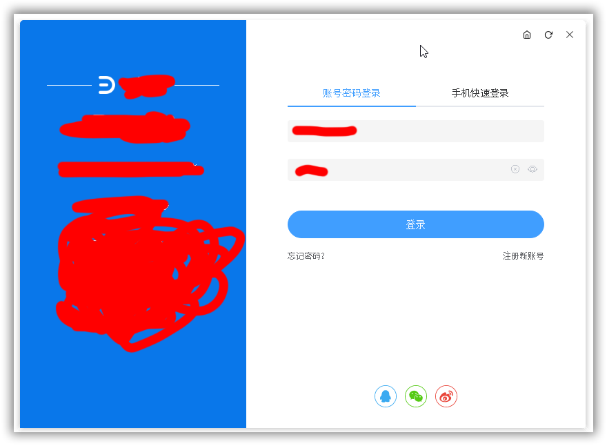
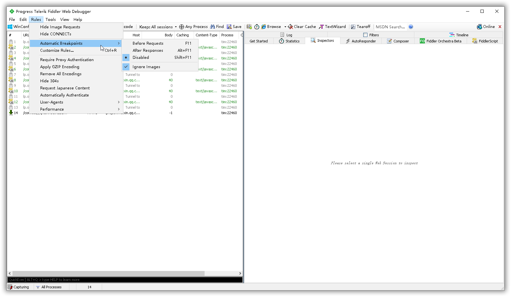
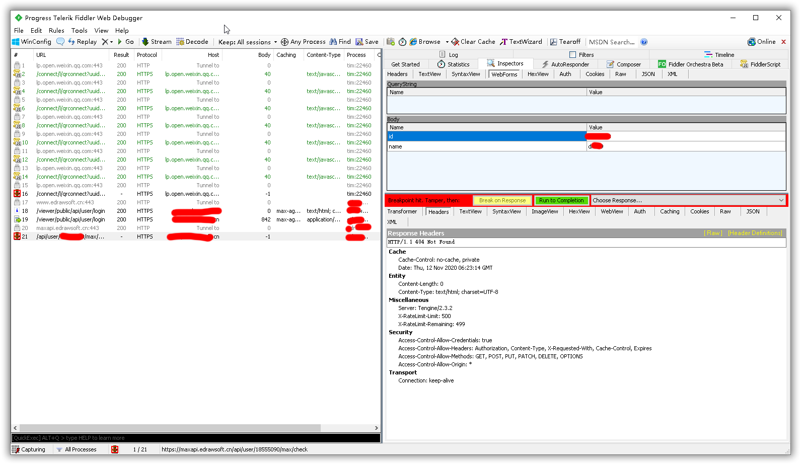
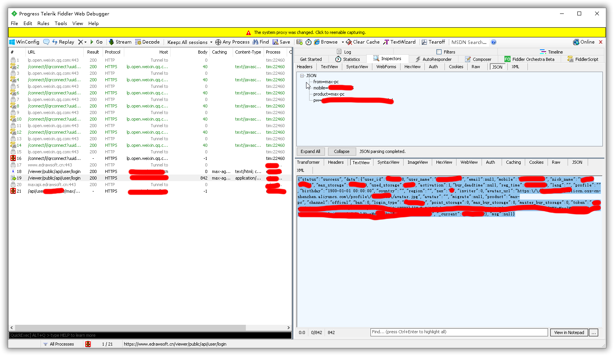
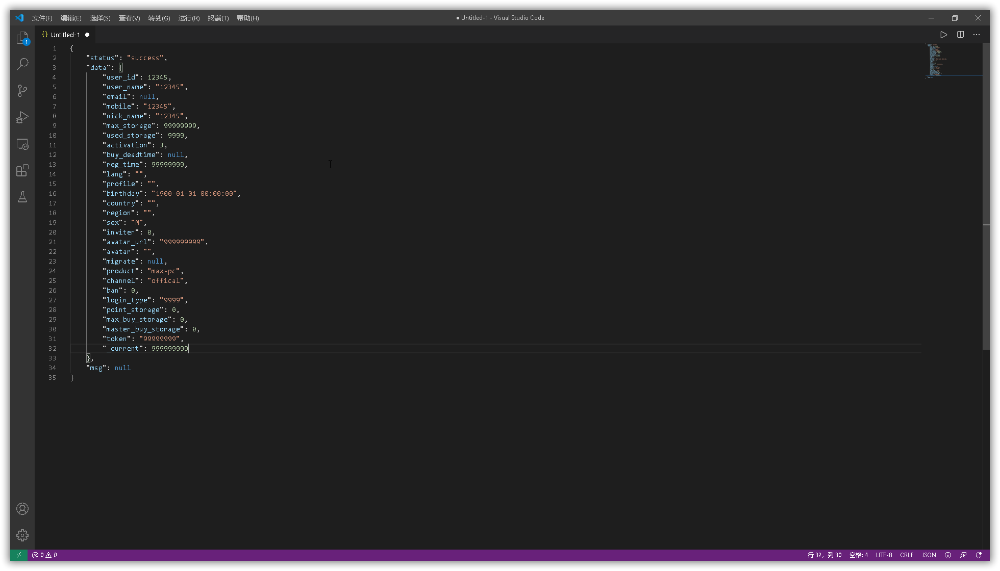
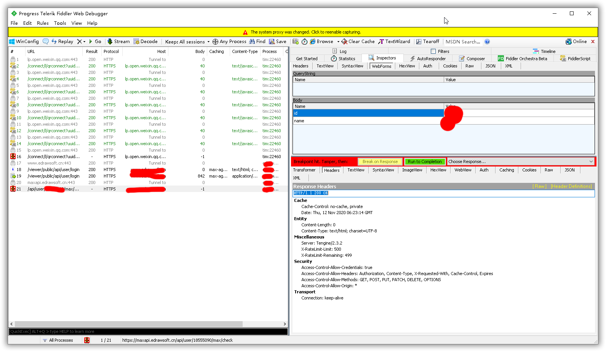
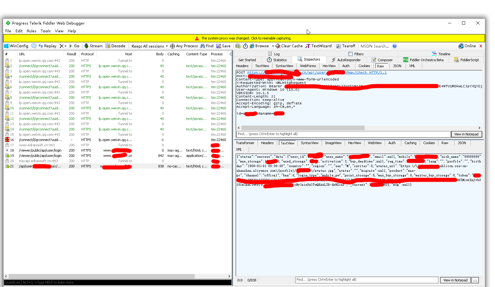
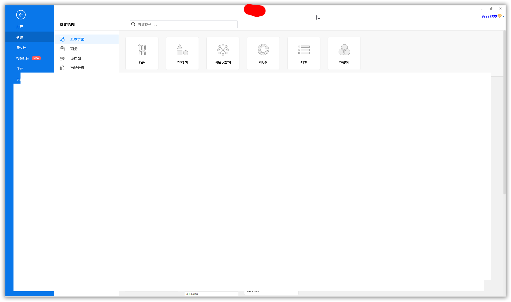
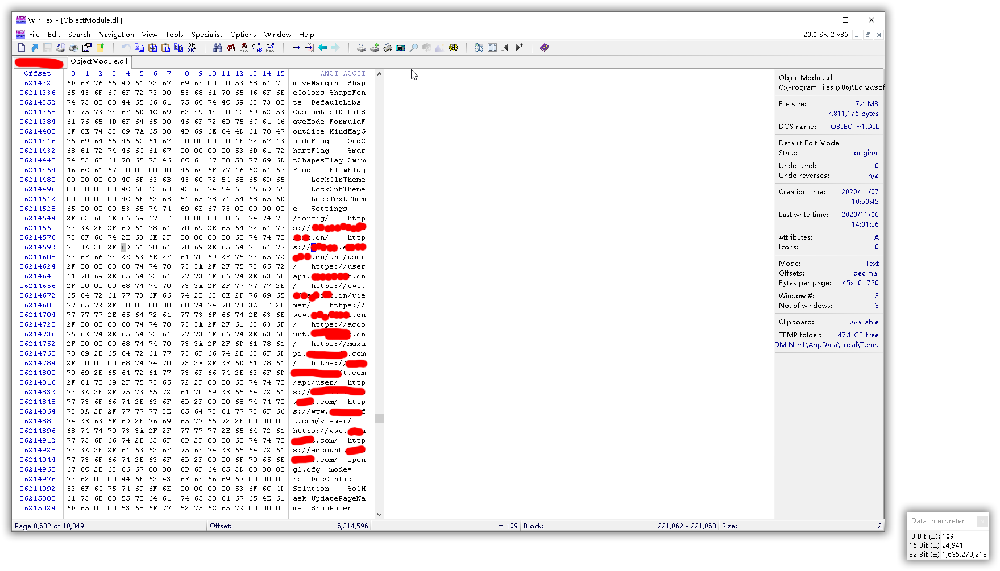
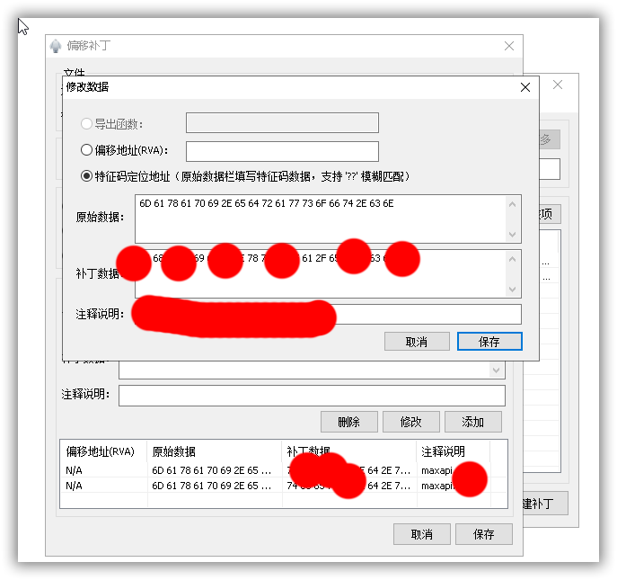

# 除了硬破外，我们还有其他选择，自建服务器实现完美破解

本文中用到的程序关键信息已经做隐藏处理，仅仅是用来帮助理解本文。本文的目的是扩展一种pj思路，除了硬破，写注册机外，我们还有其他选择

2020-11-12 By Yize

---

## 1、介绍

关于某TS，论坛上已经有大佬谈论过如何替换密钥来实现授权，看后获益匪浅，但总免不了要修改文件，很是麻烦，软件一旦升级又要重新来一遍。

还有一种方式是做劫持补丁，比较简单，但是对于中文版的而言，使用劫持补丁虽然可以解锁各种功能，但有点不能容忍的是会在软件头部显示试用版字样，不影响使用但影响心情。特征码的方式可能会在大更新中就失效了。

所以这次给大家带来的是另一种方式，实现真正的通杀（联网状态下的完美通杀）。

## 2、工具

本文使用的主要工具是：winhex,fiddler,大白补丁,idea(创建java servlet工程，做vip验证的服务端)

## 3、用fiddler抓包实现VIP授权

用这个软件前请先注册一个账号，默认你已经有一个非vip的账号。点击登陆后会弹出下面的窗口，这时候输入账号密码



然后打开fiddler,下一个响应后断点（after response）



回到登录框点击登录,放掉那两条向服务器验证的响应后，我们双击一下第三条向服务器检查的响应，点击右下角的Header可以看到，验证用户是没有发现该用户在服务器上拥有vip信息，响应码是404。现在我们来修改这个响应。



首先要修改成什么呢？

前面我们放走了两条响应，我们双击一下看看第二条响应里面有什么(关键信息已经做了处理)。



这样看似乎有点乱，我们放到VSCode里面格式化一下看看(为了避免个人信息泄露，我将个人信息乱填了一下)。我们主要关注这段json中的activation字段，其中普通会员的值是1（其实就不是会员，这里应该显示1，截图原因懒得改了），尊享会员的值是3。还有buy_deadtime字段，代表会员到期时间，单位是毫秒，这里是null。



解释完数据的作用后，我们就可以改了。把activation改成3，buy_deadtime改成一个较大的值，超过现在的时间。


上面数据只是做演示用，把你的数据改一下上面说的两个字段就可以了，这时候我们回到fiddler,把之前那个404的响应头改成200 OK



再点一下TextView，点击解码后，把修改的数据贴进去,然后放行



放行之后我们回到软件，就可以看到软件已经成功授权了



## 4、VIP服务端链接的处理

大家想一下，用fiddler这样做是不是太麻烦了点？所以我们可以扩展一种思路，劫持他访问的服务器网址，修改成我们自己的一个网址。

所以我们就得搭建一个https服务器，而且需要有效的证书，我们自己生成的证书是不受认可的，所以大家可以去阿里云、腾讯云申请免费的SSL证书(要有域名，服务器)。

至于怎么搭建的我就不多作介绍了，图个方便我就写了一个servlet运行在tomcat中。当抓包后你就会发现，他的VIP验证是这样形式的：

```java
https://服务器/api/user/用户名/max/check

```

所以我们没法用静态网页处理这样的请求，所以需要用servlet的通配符来处理这样的请求,不了解的可以先学一下servlet。我在我服务器上是这样搭建的，具体大家可以根据实际情况灵活处理

```java
@WebServlet("/ed/cn/api/user/*")//这个映射路径大家可以自己灵活配置
public class EdrawActivate extends HttpServlet {
    @Override
    protected void doGet(HttpServletRequest request, HttpServletResponse response) throws ServletException, IOException {
        request.setCharacterEncoding("utf-8");
        response.setCharacterEncoding("utf-8");
        response.setContentType("text/json");
        String requestLink=request.getRequestURL().toString();

        String state=RequestController.urlDispatcher(requestLink);//自己灵活处理，我这里是符合规则的就返回一条修改过的vip信息，也就是前面说的fiddler修改的内容，那段json
        if(state.length()==0){
            response.sendRedirect(RequestController.forwordUrl(requestLink));//自己灵活处理,我这里只管vip验证信息，其他信息一律转发了
            return;
        }else {
            PrintWriter writer=response.getWriter();
            writer.write(state);
            writer.close();
        }

    }

    @Override
    protected void doPost(HttpServletRequest req, HttpServletResponse resp) throws ServletException, IOException {
        doGet(req,resp);
    }
}

```

## 5、制作劫持补丁

经过一番努力，我发现验证vip信息的这一段请求网址存放早ObjectModel.dll中，用winhex就搜得到（论坛有大佬写出了winhex的注册文件，可以通用到最新版），关键信息已隐藏



我们需要把fiddler中抓到的网址替换为我们自己服务器的网址，至于具体怎么处理大家可以根据自己的域名来改。

最后我们用大白补丁劫持一下这个dll，把vip请求的网址改到我们自己的服务器，于是就做好了



## 6、总结

现在很多软件把本地验证改成了网络验证，但一旦网络验证的数据不加密，就和裸奔一样，任人宰割，极易实现完美的通杀，毕竟服务端API是不能轻易更改的。建议加密一下通信数据，对老版本的软件强制升级。
