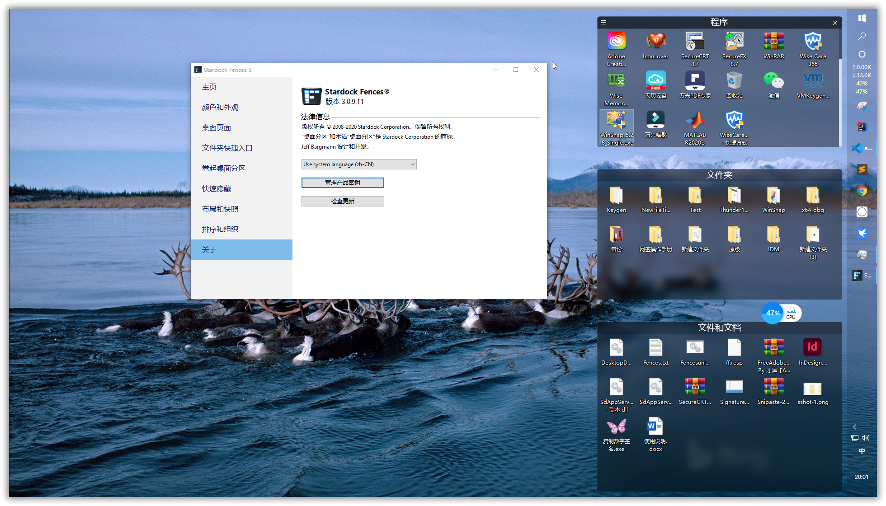
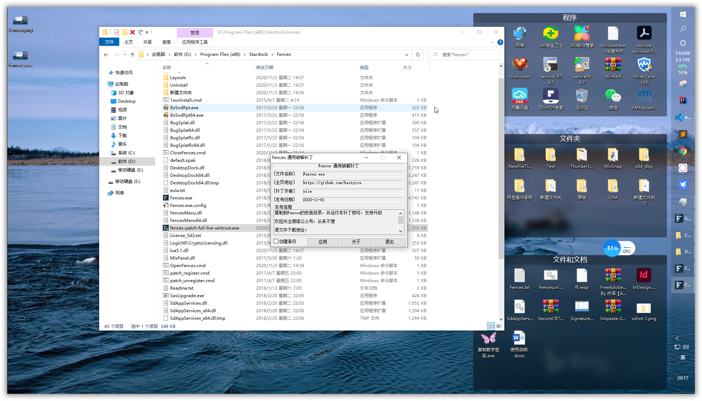

# Fences 3.0.9.11特别版

Fences是一款优秀的桌面美化软件，可以方便的组织桌面文件的显示，极大的提高桌面美观度，其软件防护做的非常出色，花了好几天才参悟出其中的原理，做出了Fences的这个通用补丁。其软件保护机制涉及了X64，Native，Windows的数字签名系统，调试器检测等等。为了绕过签名校验机制，写了自己实现的一个wintrust.dll，由于Fences在x86、x64层面上都做了wintrust校验，为了不更改系统文件，让程序可以在自己的目录做校验，修改了Fences的指向，应用补丁后生成的wantrust.dll和wbntrust以及wintrust.dll本质上都是实现的wintrust.dll的功能

---

## 实测截图

可以看到桌面东西虽然很多，但是被整理的井井有条，非常美观

## 使用方式

把补丁复制到Fences的安装目录下运行，点击应用即可,部分设备可能需要重启后才会生效

## 下载地址

[https://www.lanzoui.com/b05mmm7dc](https://www.lanzoui.com/b05mmm7dc)
