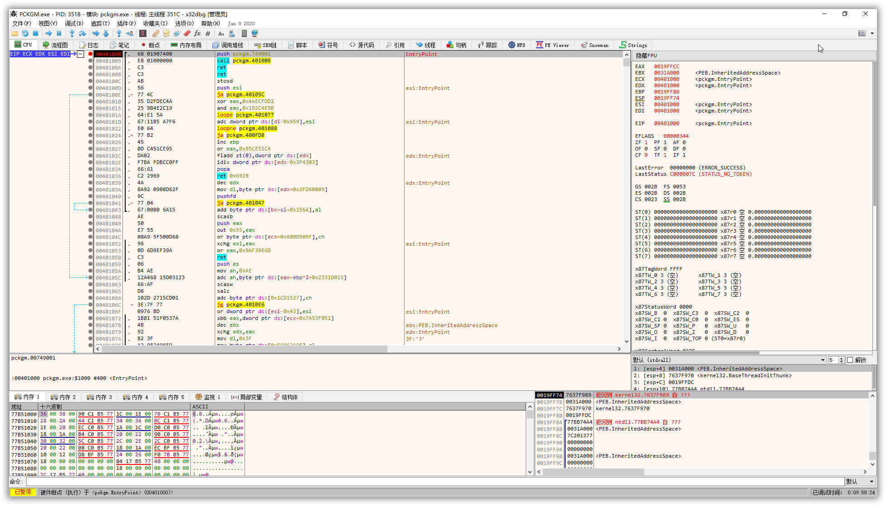
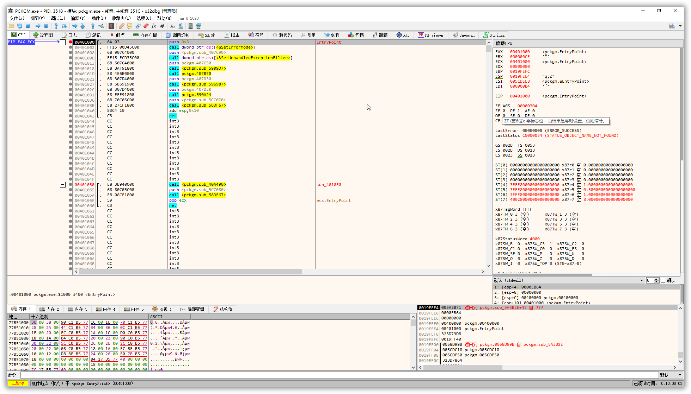
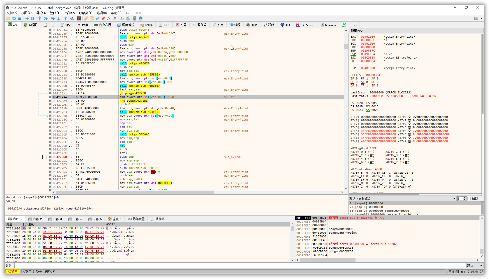
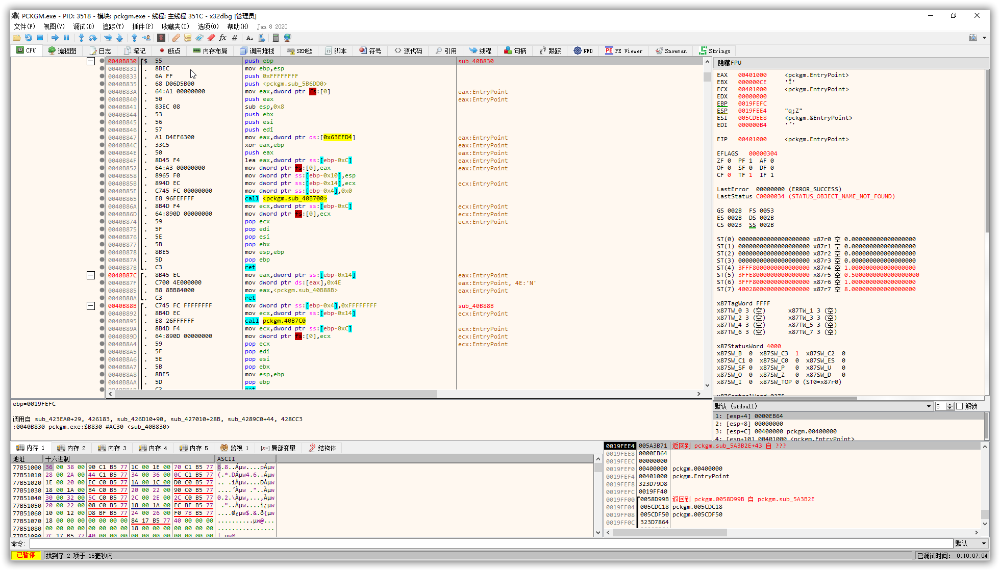
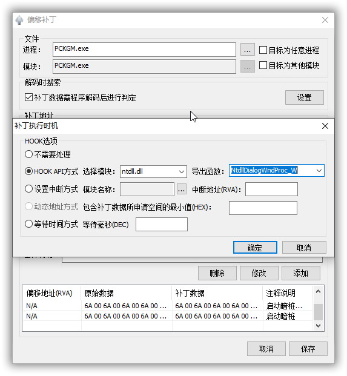

# 某B系列软件通杀

某B软件是一家国产的，专注于做加密保护软件的优秀公司，旗下的软件做的体验都很好。软件反调试做的也不错，本篇只涉及软件攻防的讨论，不提供任何成品。

## 逆向

### 1、准备工作

注意，某B的反调试做的不错，因此需要SharpOD插件帮我们隐藏调试器才可以调试。其实某B做了两层的调试器检测，第一层是检测到调试器，然后不让调试，第二层则是检测到调试器后不会触发暗桩，这也给调试工作带来了很大的麻烦。第一步只需要装上sharpOD,突破调试器第一层检测即可(调试器推荐用x32dbg,OD也可，但非常容易被杀掉进程)。另外我们需要用到的是Nisy的Baymax补丁，可以自行去爱盘或者飘云阁下载。

### 2、进入真正的程序入口

ASProtect是一种加密壳，他会隐藏真正的函数入口，在运行时动态改变执行的汇编语言，脱壳的难度很大，但我们还是需要找到真正的函数入口才能够解密。

ASProtect有个特点，基址会变成最终的函数入口，因此我们用x32DBG载入某B的软件，下一个硬件执行断点，连续运行两次后，就可以看到基址变成了真正的入口点。

**解密前**



**解密后**



### 3、突破注册信息

根据注册弹窗信息，按下F12,然后按下ALT+K，寻找函数调用栈，我们最终可以定位到如下位置，此位置上的第一个函数就是的注册验证函数。



寻找此位置也有一个通用特征码，不必每次在堆栈调用中寻找。

```d
83 7C 24 ?? 58
```

点进函数内部后，我们发现还有个函数



再深入一层，就到了决定注册信息的地方

```x86asm
0040B700 | 55                           | push ebp                                                   |
0040B701 | 8BEC                         | mov ebp,esp                                                |
0040B703 | 6A FF                        | push 0xFFFFFFFF                                            |
0040B705 | 68 906D5B00                  | push <pckgm.sub_5B6D90>                                    |
0040B70A | 64:A1 00000000               | mov eax,dword ptr fs:[0]                                   | eax:EntryPoint
0040B710 | 50                           | push eax                                                   | eax:EntryPoint
0040B711 | 83EC 10                      | sub esp,0x10                                               |
0040B714 | 53                           | push ebx                                                   |
0040B715 | 56                           | push esi                                                   |
0040B716 | 57                           | push edi                                                   |
0040B717 | A1 D4EF6300                  | mov eax,dword ptr ds:[0x63EFD4]                            | eax:EntryPoint
0040B71C | 33C5                         | xor eax,ebp                                                | eax:EntryPoint
0040B71E | 50                           | push eax                                                   | eax:EntryPoint
0040B71F | 8D45 F4                      | lea eax,dword ptr ss:[ebp-0xC]                             | eax:EntryPoint
0040B722 | 64:A3 00000000               | mov dword ptr fs:[0],eax                                   | eax:EntryPoint
0040B728 | 8965 F0                      | mov dword ptr ss:[ebp-0x10],esp                            |
0040B72B | 8BF1                         | mov esi,ecx                                                | ecx:EntryPoint
0040B72D | 8975 E4                      | mov dword ptr ss:[ebp-0x1C],esi                            | [ebp-1C]:L"commdlg_FindReplace"
0040B730 | C745 FC 00000000             | mov dword ptr ss:[ebp-0x4],0x0                             |
0040B737 | C706 17000000                | mov dword ptr ds:[esi],0x17                                | [esi]:EntryPoint
0040B73D | C745 EC 00000000             | mov dword ptr ss:[ebp-0x14],0x0                            |
0040B744 | C745 E8 00000000             | mov dword ptr ss:[ebp-0x18],0x0                            | [ebp-18]:sub_5A3B2E+43
0040B74B | 8D45 E8                      | lea eax,dword ptr ss:[ebp-0x18]                            | eax:EntryPoint, [ebp-18]:sub_5A3B2E+43
0040B74E | 50                           | push eax                                                   | eax:EntryPoint
0040B74F | 8D45 EC                      | lea eax,dword ptr ss:[ebp-0x14]                            | eax:EntryPoint
0040B752 | 50                           | push eax                                                   | eax:EntryPoint
0040B753 | 6A 00                        | push 0x0                                                   |
0040B755 | FF15 8CD05C00                | call dword ptr ds:[0x5CD08C]                               |
0040B75B | 8B4D EC                      | mov ecx,dword ptr ss:[ebp-0x14]                            | ecx:EntryPoint
0040B75E | 85C9                         | test ecx,ecx                                               | ecx:EntryPoint
0040B760 | 74 2B                        | je pckgm.40B78D                                            |
0040B762 | 8D51 01                      | lea edx,dword ptr ds:[ecx+0x1]                             | ecx+1:EntryPoint+1
0040B765 | 8A01                         | mov al,byte ptr ds:[ecx]                                   | ecx:EntryPoint
0040B767 | 41                           | inc ecx                                                    | ecx:EntryPoint
0040B768 | 84C0                         | test al,al                                                 |
0040B76A | 75 F9                        | jne pckgm.40B765                                           |
0040B76C | 2BCA                         | sub ecx,edx                                                | ecx:EntryPoint
0040B76E | 74 1D                        | je pckgm.40B78D                                            |
0040B770 | C706 58000000                | mov dword ptr ds:[esi],0x58                                | [esi]:EntryPoint, 58:'X'
0040B776 | B8 01000000                  | mov eax,0x1                                                | eax:EntryPoint
0040B77B | 8B4D F4                      | mov ecx,dword ptr ss:[ebp-0xC]                             | ecx:EntryPoint
0040B77E | 64:890D 00000000             | mov dword ptr fs:[0],ecx                                   | ecx:EntryPoint
0040B785 | 59                           | pop ecx                                                    | ecx:EntryPoint
0040B786 | 5F                           | pop edi                                                    |
0040B787 | 5E                           | pop esi                                                    |
0040B788 | 5B                           | pop ebx                                                    |
0040B789 | 8BE5                         | mov esp,ebp                                                |
0040B78B | 5D                           | pop ebp                                                    |
0040B78C | C3                           | ret                                                        |
0040B78D | C706 57000000                | mov dword ptr ds:[esi],0x57                                | 关键点2，此处写入0x58即表示注册信息有效
0040B793 | C745 FC FFFFFFFF             | mov dword ptr ss:[ebp-0x4],0xFFFFFFFF                      |
0040B79A | 33C0                         | xor eax,eax                                                | 关键点1 此处表示是否有效，我们给其不等于0即可
0040B79C | 8B4D F4                      | mov ecx,dword ptr ss:[ebp-0xC]                             | ecx:EntryPoint
0040B79F | 64:890D 00000000             | mov dword ptr fs:[0],ecx                                   | ecx:EntryPoint
0040B7A6 | 59                           | pop ecx                                                    | ecx:EntryPoint
0040B7A7 | 5F                           | pop edi                                                    |
0040B7A8 | 5E                           | pop esi                                                    |
0040B7A9 | 5B                           | pop ebx                                                    |
0040B7AA | 8BE5                         | mov esp,ebp                                                |
0040B7AC | 5D                           | pop ebp                                                    |
0040B7AD | C3                           | ret                                                        |
```

此时，我们可以改好后继续运行，程序就能在调试器中正常跑起来了。

### 4、干掉暗桩

上面说在调试器中正常运行起来，不代表我们打了补丁不需要调试器也能运行起来，实际上我们打了劫持补丁后，程序时不能正常运行的，因为某B所有软件都存在暗桩，尤其是不弹窗提示，直接闪退让人很头疼，甚至检测到调试器还会杀掉调试器进程，本身也加了强壳ASProtect,脱壳后修复IAT难度较大，动态调试程序又会正常运行，没法找到暗桩位置，所以我花了一天时间，慢慢找调用栈，最终确定了暗桩位置。某B系列所有的暗桩都依赖这一个函数触发。

```x86asm
0045B936 | 6A 04                        | push 0x4                                                   |
0045B938 | B8 6CEC5B00                  | mov eax,<pckgm.sub_5BEC6C>                                 |
0045B93D | E8 032A1300                  | call <pckgm.sub_58E345>                                    |
0045B942 | 6A 44                        | push 0x44                                                  |
0045B944 | E8 80DBFEFF                  | call <pckgm.sub_4494C9>                                    |
0045B949 | 59                           | pop ecx                                                    |
0045B94A | 8945 F0                      | mov dword ptr ss:[ebp-0x10],eax                            |
0045B94D | 33FF                         | xor edi,edi                                                |
0045B94F | 897D FC                      | mov dword ptr ss:[ebp-0x4],edi                             |
0045B952 | 85C0                         | test eax,eax                                               |
0045B954 | 74 0F                        | je pckgm.45B965                                            |
0045B956 | FF75 0C                      | push dword ptr ss:[ebp+0xC]                                |
0045B959 | 8BC8                         | mov ecx,eax                                                |
0045B95B | FF75 08                      | push dword ptr ss:[ebp+0x8]                                |
0045B95E | E8 B6FEFFFF                  | call <pckgm.sub_45B819>                                    |
0045B963 | 8BF8                         | mov edi,eax                                                |
0045B965 | FF75 1C                      | push dword ptr ss:[ebp+0x1C]                               |
0045B968 | 8B45 18                      | mov eax,dword ptr ss:[ebp+0x18]                            |
0045B96B | 8BCF                         | mov ecx,edi                                                |
0045B96D | FF75 14                      | push dword ptr ss:[ebp+0x14]                               |
0045B970 | 834D FC FF                   | or dword ptr ss:[ebp-0x4],0xFFFFFFFF                       |
0045B974 | 83C8 04                      | or eax,0x4                                                 |
0045B977 | 50                           | push eax                                                   |
0045B978 | E8 0C040000                  | call <pckgm.sub_45BD89>                                    |
0045B97D | 85C0                         | test eax,eax                                               |
0045B97F | 75 15                        | jne pckgm.45B996                                           |
0045B981 | 8B07                         | mov eax,dword ptr ds:[edi]                                 |
0045B983 | 8B70 78                      | mov esi,dword ptr ds:[eax+0x78]                            |
0045B986 | 8BCE                         | mov ecx,esi                                                |
0045B988 | FF15 14DC5C00                | call dword ptr ds:[<&sub_402900>]                          |
0045B98E | 8BCF                         | mov ecx,edi                                                |
0045B990 | FFD6                         | call esi                                                   |
0045B992 | 33C0                         | xor eax,eax                                                |
0045B994 | EB 1D                        | jmp pckgm.45B9B3                                           |
0045B996 | FF75 10                      | push dword ptr ss:[ebp+0x10]                               |
0045B999 | FF77 2C                      | push dword ptr ds:[edi+0x2C]                               |
0045B99C | E8 63465905                  | call 0x59F0004                                             |
0045B9A1 | FB                           | sti                                                        |
0045B9A2 | F645 18 04                   | test byte ptr ss:[ebp+0x18],0x4                            |
0045B9A6 | 75 09                        | jne pckgm.45B9B1                                           |
0045B9A8 | FF77 2C                      | push dword ptr ds:[edi+0x2C]                               |
0045B9AB | E8 54465B05                  | call 0x5A10004                                             |
0045B9B0 | 828B C7E85629 13             | or byte ptr ds:[ebx+0x2956E8C7],0x13                       |
0045B9B7 | 57                           | push edi                                                   |
0045B9B8 | C2 1800                      | ret 0x18                                                   |

```

最后返回的三个字节是,调试器有时候可能识别不出来，翻译成汇编语言就是ret 0x18，让esp寄存器加上0x18

```x86asm
C2 18 00
```

找到暗桩的具体细节就不表述了，给出一个通用特征码

```x86asm
6A ?? ?? ?? ?? ?? ?? E8 ?? ?? ?? ?? 6A 44
```

需要注意的是，此处的暗桩函数不完全是暗桩，也为一些功能提供必要的支持，直接ret 0x18是不行的，会破坏正常功能。而且此函数也做了esp寄存器的操作，即使nop掉调用的地方，也需要平衡下esp寄存器。所以我们需要在调用到这个暗桩函数的地方打上断点，测试一下才能nop掉这个暗桩调用。为了平衡esp寄存器，我们需要用指令

```x86asm
add esp,0x18
```

代替原来的暗桩调用指令。

至此，软件就可以正常使用了。


### 5、如何制作补丁

对于加密过的程序，如何用大白制作补丁也是需要思考的，给出一个一般来说通用的方法，大白支持通过hook api的方式打补丁，打补丁也是需要在程序解密后才可以的，否则就会失败。

一般来说，在程序界面即将加载的时候，程序就已经完全解密了，在界面加载完成后或者加载的过程中做注册验证，所以我们可以以程序界面创建的API作为需要hook的api，也可以在程序界面加载完成后，按下F12 ,然后ALT+K查看调用堆栈，找到一个可用的API。我所hook的API是ntdll.dll里面的

```c++
NtdllDialogWndProc_W
```



### 6、总结

ASProtect壳尽管很好，但只能对抗静态分析，在基址下一次硬件断点连续运行两次后，ASProtect会回到基址完全解码，此时和没加壳就没什么区别了，程序完全裸奔，尽管dump后因为IAT表丢失无法运行，但是我们还是可以采用劫持策略来实现**不修改任何字节**情况下的破解。

所以在软件保护上，还是需要了解加密壳的用法，对程序关键部位VM，这样既不会丢失软件太多的性能，又可以极大地增加软件的安全性。

做双层调试器检测的想法是很好的，第一层禁止调试器调试，第二层检测到调试器就正常运行，没有调试器就无法正常运行，改变程序运行的逻辑，暗桩位置极难确定，目前我只遇到过、WinSnap、某B系列软件、Fences（之前我发过Fences的逆向教程，但后来我发现那是有问题的，最近已经对Fences进行了彻底分析，彻底解决了Fences的暗桩，不得不说Fences防护策略做的太出色）采用过。

### 7、声明

本篇仅涉及软件攻防的技术讨论，反对针对国产优秀软件的成品破解。
