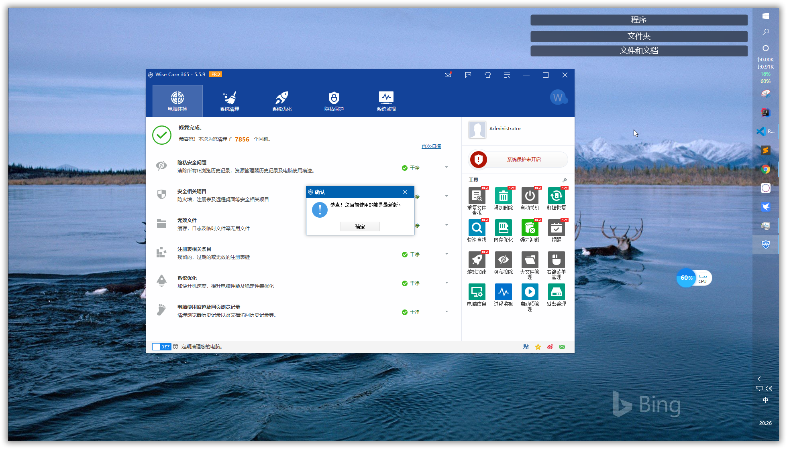
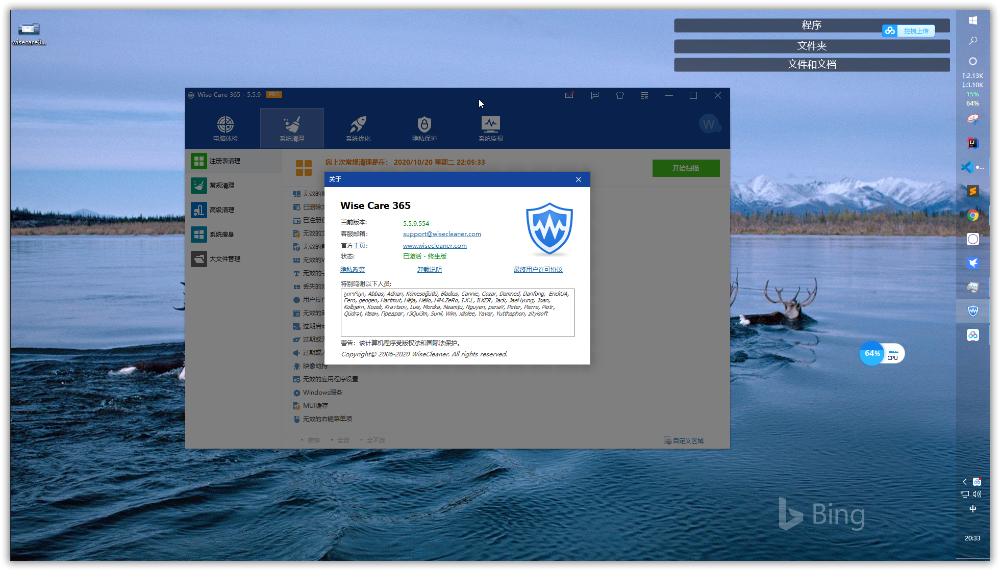

# WiseCare365 特别版

WiseCare365是一款类似于360-腾讯电脑管家-火绒等产品的工具，可以将其看成不流氓版的上述程序。WiseCare365体积小,只有11M。

由于是纯粹的电脑守护工具，没有其他无关的功能，所以效率高，是清理注册表和磁盘垃圾文件，保护个人隐私记录，提高电脑使用安全。优化系统、提高Windows系统运行速度最好的选择之一。

**本补丁是我2017年写的，坚持到现在已经三年多，仍然可以通杀最新版本。**

---

## 实测截图

## 使用方法

只需要把补丁复制到安装目录，点击补丁即可。只需要运行一次补丁，后面升级时可以直接升级。补丁已经坚持了三年多，一直可以通杀。但是有时候WindowsDefender等工具或错误地将其视为病毒，包括生成的几个文件，这时候你可将其加入白名单。

## 下载地址

补丁下载地址

[https://www.lanzoui.com/b05mmm98j](https://www.lanzoui.com/b05mmm98j)

wisecare365下载地址

[https://www.lanzoui.com/b05mmm9ta](https://www.lanzoui.com/b05mmm9ta)

或者去官网下载最新版

[https://www.wisecleaner.com/wise-care-365.html](https://www.wisecleaner.com/wise-care-365.html)